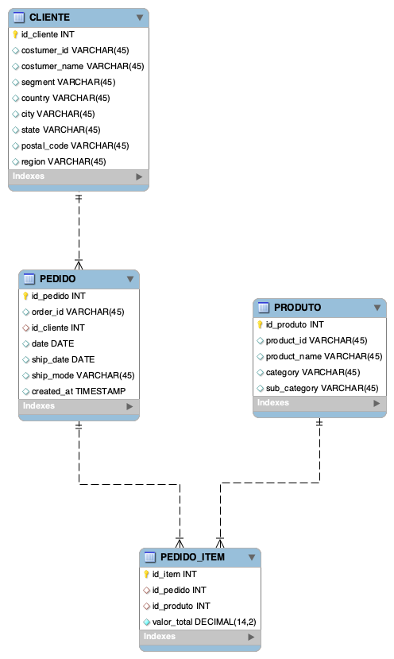

# Projeto de Business Intelligence — Datamart de Vendas

## Entrega 1 — Descrição do Dataset e Objetivo de Negócio

### Descrição do Dataset

O conjunto de dados escolhido é o **Sales Forecasting Dataset**, disponível no [Kaggle](https://www.kaggle.com/datasets/rohitsahoo/sales-forecasting).  
O dataset contém **registros de vendas de uma operação de varejo**, abrangendo informações sobre **pedidos, clientes, produtos, localização e valor de venda**.

Cada linha representa **um item de pedido** (um produto vendido em uma data específica para um cliente).

#### Estrutura do dataset

| Coluna | Descrição |
|--------|------------|
| **Row ID** | Identificador único da linha do dataset. |
| **Order ID** | Identificador do pedido realizado. |
| **Order Date** | Data em que o pedido foi feito. |
| **Ship Date** | Data em que o pedido foi enviado. |
| **Ship Mode** | Modalidade de envio (Standard, First Class, etc.). |
| **Customer ID** | Identificador único do cliente. |
| **Customer Name** | Nome do cliente. |
| **Segment** | Segmento do cliente (Consumer, Corporate ou Home Office). |
| **Country** | País do cliente. |
| **City** | Cidade onde o pedido foi realizado. |
| **State** | Estado ou província. |
| **Postal Code** | Código postal. |
| **Region** | Região geográfica do país. |
| **Product ID** | Identificador único do produto. |
| **Category** | Categoria principal do produto. |
| **Sub-Category** | Subcategoria do produto. |
| **Product Name** | Nome do produto vendido. |
| **Sales** | Valor total da venda em dólares. |

---

###  Objetivo de Negócio

O objetivo do projeto é **analisar o desempenho das vendas da empresa** ao longo do tempo, identificando padrões e oportunidades de crescimento.  
A partir da construção de um **Datamart de Vendas**, pretende-se responder a perguntas gerenciais como:

1. **Como evoluem as vendas ao longo do tempo (mês, trimestre, ano)?**  
2. **Quais regiões, estados e cidades geram maior receita?**  
3. **Quais categorias e subcategorias de produtos são mais rentáveis?**  
4. **Quais segmentos de clientes mais contribuem para as vendas?**  

Essas análises permitirão compreender o **comportamento de compra dos clientes**, otimizar o **planejamento logístico e de estoque**, e **apoiar decisões estratégicas** de marketing e operações.

---

## Entrega 2 — Importação e qualificação dos dados

Para importar o dataset utilizado, basta utilizar o script operation_data/create_oltp_tables.py

Será necessário algumas informações presentes no arquivo .env para funcionar sem nenhuma flag, como:

DATABASE_URL -> Endpoint do banco de dados PostgreSQL
KAGGLE_DATASET -> Nesse datamart, será o dataset <strong>rohitsahoo/sales-forecasting</strong><br>
KAGGLE_USERNAME -> Username do Kaggle, para utilização da API
KAGGLE_KEY -> Chave de API da Kaggle

Além disso, será necessário ativar o Ambiente Virtual do Python e baixar as dependências:

```
LINUX/MACOS
python -m venv venv
source venv/bin/activate
pip install -r requirements.txt

WINDOWS
python -m venv venv
venv/Scripts/activate
pip install -r requirements.txt
```

<strong>Tenha certeza que o interpretador python utilizado pela sua IDE é o do ambiente virtual ativado.</strong>

Tendo essas informações, basta executar no terminal:

```
python operation_data/create_oltp_tables.py
```

Caso prefira baixar o dataset e utilizar localmente, coloque o arquivo csv em data e execute

```
python operation_data/create_oltp_tables.py --no-download --csv data/meu_arquivo.csv
```

Dessa maneira, o script irá utilizar o arquivo do dataset para criar a tabela staging (sem tratamento, exatamente como o arquivo csv) e as tabelas operacionais Cliente, Pedido, Produto e Pedido_Item.

---

## Entrega 3 — Modelo Lógico-Relacional das tabelas operacionais



---

## Entrega 4 — Construção da tabela fato e tabelas dimensão

A construção das tabelas dimensão e fato utiliza o script datamart/create_dimension_tables.py

Basta executar o script conforme o comando abaixo, e serão criadas dentro do schema dw as 5 tabelas: fact_sales, dim_product, dim_costumer, dim_date e dim_ship_mode

```
python datamart/create_dimension_tables.py
```

---

## Entrega 5 — Fluxo ETL

O fluxo para popular as tabelas na Entrega 4 é executado pelo script datamart/etl.py

Basta executar:
```
python datamart/etl.py
```

Com isso, as 5 tabelas estarão com os valores importados das tabelas operacionais

---

## Entrega 6 — Criação de consultas analíticas

As consultas analíticas são realizadas pelo script analitico.sql, presente na pasta root do repositório.

Segue uma descrição que cada operação busca nas tabelas dimensão:

### 1️⃣ ROLLUP – Total de vendas por Ano, por Mês e Total Geral

Essa consulta produz uma visão hierárquica de vendas ao longo do tempo:

- Total de vendas por ano e mês  
- Subtotais por ano (mês NULL)  
- Total geral (ano e mês NULL)

Permite enxergar métricas ao longo da hierarquia temporal (Ano → Mês), essencial para sazonalidade e tendências.

**Perguntas respondidas:**
- Quanto vendemos em cada mês?  
- Quanto vendemos em cada ano?  
- Qual o total geral do período?

---

### 2️⃣ CUBE – Total de vendas por Região e Segmento

Essa consulta gera todas as combinações possíveis entre Região e Segmento, incluindo subtotais e total geral.

O CUBE expande a agregação multidimensional:

- Vendas por região × segmento  
- Subtotal por região  
- Subtotal por segmento  
- Total geral

**Perguntas respondidas:**
- Quais regiões mais vendem para cada segmento?  
- Qual o desempenho total de cada segmento?  
- Qual região apresenta melhor resultado geral?

---

### 3️⃣ RANK – Ranking das Categorias por Ano

Cria um ranking anual das categorias de produto baseado no total de vendas.

O RANK() com PARTITION BY ano permite comparar categorias dentro de cada ano.

**Perguntas respondidas:**
- Quais categorias mais venderam em cada ano?  
- Qual categoria liderou em determinado ano?  
- Como as categorias se posicionam ao longo do tempo?

---

### 4️⃣ DENSE_RANK – Top Categorias por Segmento

Ranking das categorias dentro de cada segmento de cliente.

O DENSE_RANK() identifica TOP N sem pular posições em caso de empate.

**Perguntas respondidas:**
- Quais categorias performam melhor para cada segmento?  
- Quais são as TOP 3 categorias por segmento?  
- Como cada segmento contribui nas vendas por categoria?

---

### 5️⃣ LAG – Variação mensal das vendas

Compara as vendas do mês atual com o mês anterior.

Usa LAG() para recuperar a métrica do mês passado na mesma linha.

Calcula:

- Total de vendas no mês  
- Total de vendas no mês anterior  
- Diferença entre eles  

**Perguntas respondidas:**
- As vendas estão crescendo ou caindo mês a mês?  
- Qual foi a variação absoluta?  
- Qual mês teve o maior aumento ou queda?

---

## Entrega 7 — Visualização dos dados em Power BI

